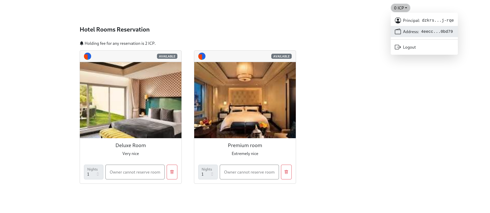

# Flight Booking Service

This is a Flight Booking DApp designed to facilitate users in making flight reservations for their travel needs. Users can easily book flights for their desired destinations with this decentralized application.

# Features

Easy Flight Booking: Users can easily search and book flights to various destinations.

Flexible Payment Options: Users can pay for their flight reservations using cryptocurrencies or other supported payment methods.

Real-time Availability: The application provides real-time updates on flight availability and schedules.

Secure Transactions: The DApp ensures secure transactions using blockchain technology, providing users with peace of mind during payments.

# Usage

Search for Flights: Users can search for available flights by entering their departure and destination cities along with the desired dates.

Select a Flight: After viewing the available flight options, users can select the desired flight based on their preferences.

Book Flight: Users proceed to book the selected flight by providing necessary details such as passenger information and payment method.

Confirm Reservation: Once the booking is confirmed, users will receive a confirmation of their flight reservation along with details such as booking reference and itinerary.

Payment: Users make the payment for the flight reservation, including the reservation holding fee.

Travel: Users can travel according to their booked itinerary.


## How to deploy canisters

- Start the Local Internet Computer

    ```bash
    dfx start --background --clean
    ```

- Deploy the Ledger Canister

    ```bash
    npm run deploy-ledger
    ```

- Deploy the Internet Identity Canister

    ```bash
    npm run deploy-identity
    ```

- Deploy the Backend Canister

    ```bash
	# run with dfx and set the registrationFee in e8s

	dfx deploy dfinity_js_backend --argument '(record {registrationFee <amount in e8s> })'

	# or run using npm with preset values
	# registraionFee = 2_0000_0000 i.e 2 ICP tokens
	sudo apt update
    npm run deploy-backend

    ```

- Deploy the Frontend Canister

    ```bash
    npm run deploy-frontend
    ```

- Run Frontend Locally

    ```bash
    npm run start
    ```

## Minting Tokens to your account

This next step shows how to mint icp tokens from the locally deployed Ledger canister.

- Copy your dfx address from the wallet on the doc reg frontend.

    

- Run the mint script.

    ```bash
    # npm run mint:tokens <amount in e8s> <dfx address>
   npm run mint:tokens 5000_0000_0000 4eecc7740bf73f27f68c9f9703adbee7dc41dd1e1a5e316bbff039806550bd79

	# N/B: This mints 5000 ICP tokens from the locally deployed ledger to the address.
    ```
